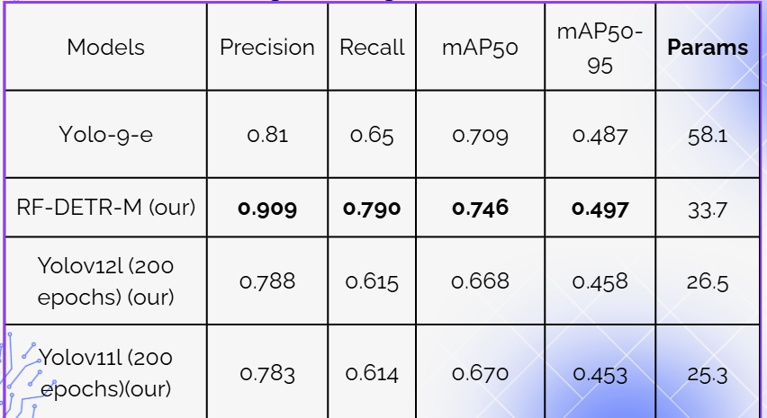
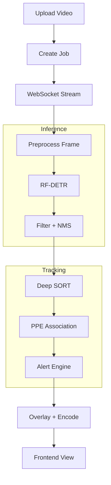

# CS406 Final Report - PPE Detection System

A personal protective equipment (PPE) detection system for industrial and warehouse environments. The project combines an RF-DETR model, a FastAPI backend with real-time WebSocket streaming, a Vite/React frontend, and training/evaluation notebooks.

## Objectives

- Detect people and PPE classes: `person`, `helmet`, `safety-vest`, `gloves`, and `shoes`.
- Track people across video frames with Deep SORT.
- Associate detected PPE items with each tracked person.
- Raise alerts when required PPE is missing for multiple consecutive frames.
- Support real-time optimization with ONNX/TensorRT and stream configuration.
- Store training results, evaluation outputs, and technical analysis for the CS406 report.

## Demo


---

### Result Summary



## System Architecture



### Main Processing Flow

1. The frontend uploads a video to the backend.
2. The backend stores the temporary video and creates a `job_id`.
3. The frontend opens a WebSocket connection using the `job_id`.
4. The backend reads frames, resizes them, and applies frame skipping based on `STREAM_CONFIG`.
5. The RF-DETR runtime detects objects in each selected frame.
6. The system filters detections by `ACTIVE_CLASSES` and applies NMS to reduce duplicate boxes.
7. Deep SORT creates or updates person tracks.
8. `ppe_association.py` associates PPE detections with each person track using body regions.
9. `alert_engine.py` evaluates missing PPE by duration and streak stability.
10. Annotated frames with bounding boxes, track IDs, and alerts are JPEG-encoded and streamed to the frontend.

## Project Structure

```text
CS406_final_report/
├── README.md                         # Project overview documentation
├── requirements.txt                   # Root-level Python dependencies
├── rf_detr_loader.py                  # Standalone RF-DETR loader/inference experiment
├── video_optimization.py              # Resize, frame skip, and target FPS configuration
│
├── backend/                           # Real-time detection backend
│   ├── app/
│   │   ├── main.py                    # FastAPI application entrypoint
│   │   ├── api/
│   │   │   └── ws_routes.py           # Upload endpoint and WebSocket streaming loop
│   │   ├── core/
│   │   │   └── config.py              # Active classes, thresholds, tracking, and alert config
│   │   └── services/
│   │       ├── alert_engine.py        # WARN/VIOLATION/CRITICAL alert logic
│   │       ├── frame_processing.py    # Filtering, timestamps, and overlay drawing
│   │       ├── job_store.py           # Temporary video job storage by job_id
│   │       ├── ppe_association.py     # PPE association for each person track
│   │       ├── runtime_selector.py    # TensorRT/ONNX/Native runtime selection
│   │       └── tracking_service.py    # Deep SORT wrapper
│   ├── model_runtime.py               # Detection dataclass and payload converter
│   ├── rfdetr_runtime.py              # Native/ONNX/TensorRT RF-DETR runtimes
│   ├── export_rfdetr_onnx.py          # Export model to ONNX
│   ├── build_rfdetr_tensorrt.py       # Build TensorRT engine
│   ├── benchmark_rfdetr_runtime.py    # Benchmark runtime models
│   ├── estimate_person_distance.py    # Estimate distance by person detection
│   ├── estimate_distance_homography.py # Estimate distance with homography
│   ├── models/                        # Backend model/runtime artifacts
│   ├── data/                          # Legacy backend dataset/training scripts
│   ├── runs/                          # Backend run outputs
│   └── tests/                         # Backend unit/integration tests
│
├── frontend/                          # Vite/React frontend
│   ├── src/app/
│   │   ├── App.tsx                    # App shell
│   │   ├── config.ts                  # API/WS base URL configuration
│   │   ├── routes.tsx                 # Route definitions
│   │   ├── pages/UploadPage.tsx       # Upload and real-time stream UI
│   │   ├── services/
│   │   │   ├── uploadApi.ts           # POST video upload client
│   │   │   └── streamSocket.ts        # WebSocket client
│   │   ├── components/                # UI components
│   │   ├── context/                   # React context
│   │   └── layout/                    # Layout components
│   ├── package.json                   # Frontend scripts and dependencies
│   ├── vite.config.ts                 # Vite configuration
│   └── .env                           # Frontend API/WS environment variables
│
├── models/                            # Project-level checkpoint/model artifacts
├── notebooks/                         # Training/evaluation/augmentation notebooks
│   └── cs406-rf-detr-augmentation.ipynb
├── results/
│   └── evaluation/                    # Evaluation metrics and reports
│       ├── per_class_metrics.csv
│       ├── overall_metrics.csv
│       ├── speed_metrics.csv
│       └── evaluation_report.txt
├── docs/                              # Detailed technical documentation
│   ├── frontend.md
│   ├── frontend_detailed.md
│   ├── optimize_model.md
│   ├── system_issues.md
│   └── tracking.md
├── deploy/                            # Deployment resources, if available
├── public/                            # Static assets
└── scripts/                           # Utility scripts
```

## Backend Components

### `backend/app/api/ws_routes.py`

Main real-time orchestration layer:

- `POST /detect/upload`: receives a video and creates a `job_id`.
- `WS /detect/stream/{job_id}`: reads the video, runs detection, tracking, and alerting, then streams annotated frames.

Pipeline inside this route:

```text
VideoCapture
→ should_process_frame
→ resize_frame
→ get_detection_runtime().predict
→ filter_detections_by_active_classes
→ TrackingService.update_tracks
→ associate_ppe_with_tracks
→ AlertEngine.evaluate_tracks
→ annotate_frame + annotate_tracking_overlay
→ WebSocket send_json
```

### `backend/rfdetr_runtime.py`

Manages RF-DETR runtimes:

- `RFDETRNativeRuntime`: runs the native RF-DETR checkpoint through the RF-DETR library.
- `RFDETRONNXRuntime`: runs inference with ONNX Runtime.
- `RFDETRTensorRTRuntime`: runs inference with a TensorRT engine.

This file also includes:

- Frame preprocessing for model input.
- Output postprocessing into `Detection` objects.
- Class-wise NMS using `NMS_IOU_THRESHOLD`.

### `backend/app/services/runtime_selector.py`

Selects the inference runtime by priority and fallback order:

1. TensorRT when the engine and GPU are available.
2. ONNX when the runtime is available.
3. Native RF-DETR as the final fallback.

### `backend/app/services/tracking_service.py`

Deep SORT wrapper:

- Sends only `person` detections to the tracker.
- Outputs tracks with `track_id`, `bbox_xyxy`, `hits`, `age`, and `missed`.

### `backend/app/services/ppe_association.py`

Associates PPE with each person:

- Does not rely only on simple bounding-box intersection.
- Uses PPE bounding-box centers and body regions:
  - helmet: head region.
  - safety vest: torso region.
  - shoes: lower-leg/foot region.
- Each PPE detection is assigned to the nearest valid person track.

### `backend/app/services/alert_engine.py`

Evaluates alert states:

- `NORMAL`: no missing PPE, or the track is not stable enough yet.
- `SUSPECTED_VIOLATION`: PPE is missing but has not exceeded the duration threshold.
- `CONFIRMED_VIOLATION`: PPE is missing continuously beyond `ALERT_VIOLATION_THRESHOLD_MS`.
- `critical`: the violation lasts beyond `ALERT_ESCALATION_MS`.

The engine uses missing streaks to reduce noise from detection flicker.

## Important Configuration

In `backend/app/core/config.py`:

| Variable | Meaning |
| --- | --- |
| `DEVICE`, `DEVICE_LABEL` | Model execution device; prefers automatic CUDA detection when available |
| `ACTIVE_CLASSES` | Classes kept after detection |
| `CONFIDENCE_THRESHOLD` | Detection confidence threshold |
| `NMS_IOU_THRESHOLD` | IoU threshold for class-wise NMS |
| `STREAM_CONFIG` | Resize, frame skip, and target FPS settings |
| `TRACKING_MAX_AGE` | Number of frames a track is kept after missing detections |
| `TRACKING_N_INIT` | Number of frames required to confirm a track |
| `TRACKING_MAX_IOU_DISTANCE` | IoU matching threshold for the tracker |
| `ALERT_VIOLATION_THRESHOLD_MS` | Missing-PPE duration required to mark a violation |
| `ALERT_COOLDOWN_MS` | Minimum interval between alerts for the same track |
| `ALERT_ESCALATION_MS` | Duration required to escalate a violation to critical |
| `ALERT_MIN_TRACK_AGE` | Minimum track age required before alert evaluation |
| `ALERT_MIN_TRACK_HITS` | Minimum number of hits required before alert evaluation |

## Frontend Workflow

The frontend is located in `frontend/` and uses Vite/React.

Main flow:

1. The user selects a video in `UploadPage.tsx`.
2. `uploadApi.ts` uploads the video to the backend.
3. The backend returns a `job_id`.
4. `streamSocket.ts` opens a WebSocket connection.
5. The frontend receives frame payloads containing:
   - Base64 JPEG image.
   - Number of processed frames.
   - FPS and latency.
   - Detections, tracks, and alerts.
6. The UI displays the video stream, track state, and live alerts.

Frontend environment variables:

```env
VITE_API_BASE_URL=http://localhost:8000
VITE_WS_BASE_URL=ws://localhost:8000
```

## Development Workflow

### 1. Install Backend Dependencies

```powershell
conda create -n cs406 python=3.10
conda activate cs406
pip install -r requirements.txt
```

If the backend has its own dependency file, install it from `backend/` as needed.

### 2. Run the Backend

```powershell
uvicorn backend.app.main:app --reload --host 0.0.0.0 --port 8000
```

### 3. Install Frontend Dependencies

```powershell
npm install --prefix frontend
```

### 4. Run the Frontend

```powershell
npm run dev --prefix frontend
```

### 5. Test Real-Time Detection

1. Open the frontend through the Vite URL.
2. Upload a video.
3. Click Start.
4. Observe:
   - Stream FPS.
   - Track ID.
   - `OK`, `WARN`, and `VIOLATION` states.
   - Live alerts.

## Model Training and Evaluation Workflow

### Notebook

Main notebook:

```text
notebooks/cs406-rf-detr-augmentation.ipynb
```

Used for:

- Data augmentation.
- RF-DETR training/fine-tuning.
- Model evaluation.
- Metric export for the report.

### Evaluation Results

Metrics are stored in:

```text
results/evaluation/
```

Important files:

- `per_class_metrics.csv`: precision, recall, F1, and mAP by class.
- `overall_metrics.csv`: overall metrics.
- `speed_metrics.csv`: inference/evaluation speed metrics.
- `evaluation_report.txt`: consolidated text report.

Current note: `safety-vest` has significantly lower recall than the other classes, so the runtime should use smoothing/hysteresis to avoid false violations when vest detections flicker.

## Performance Optimization Workflow

Current and tunable optimization points:

1. **Runtime selection**
   - Use TensorRT on GPU when available.
   - Use ONNX/Native as fallbacks.

2. **Stream configuration**
   - Reduce `max_width` to lower latency.
   - Increase `frame_skip` in crowded scenes.
   - Reduce JPEG quality when encoding or network transfer becomes a bottleneck.

3. **Detection postprocessing**
   - `CONFIDENCE_THRESHOLD` controls detection sensitivity.
   - `NMS_IOU_THRESHOLD` reduces duplicate boxes.
   - `ACTIVE_CLASSES` filters required classes after prediction.

4. **Tracking and association**
   - Deep SORT tracks only people.
   - PPE association uses body regions instead of raw overlap.

5. **Alert stability**
   - Tracks must have enough `age` and `hits`.
   - Missing PPE must persist long enough before violation.
   - Classes with low recall, such as `safety-vest`, should be smoothed by track before lowering alert thresholds.

## Real-Time API Payload

Each WebSocket frame sends a payload in this format:

```json
{
  "type": "frame",
  "frame": "<base64-jpeg>",
  "processed_frames": 12,
  "frame_index": 36,
  "timestamp_ms": 1200,
  "source_fps": 30,
  "output_fps": 30,
  "boxes_before_filter": 20,
  "boxes_after_filter": 8,
  "detections": [],
  "tracks": [],
  "alerts": []
}
```

`done` payload:

```json
{
  "type": "done",
  "reason": "completed"
}
```

## Related Documentation

- `docs/tracking.md`: tracking and association notes.
- `docs/optimize_model.md`: model/runtime optimization guidance.
- `docs/system_issues.md`: known system issues and solutions.
- `docs/frontend_detailed.md`: detailed frontend documentation.

## Operations Notes

- Restart the backend after changing backend/config files so modules are reloaded.
- If the WebSocket reports `invalid job_id`, upload the video again to create a new job.
- If the GPU is unstable, keep `DEVICE_LABEL` on auto-detection instead of hardcoding CUDA.
- If bounding boxes overlap heavily, reduce `NMS_IOU_THRESHOLD`.
- If PPE detections flicker, prioritize per-track smoothing before lowering alert thresholds.
