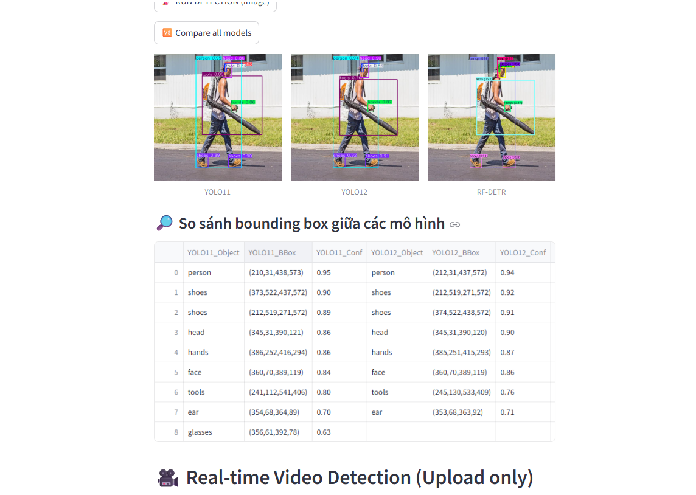
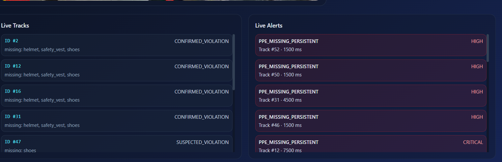

# CS406 Final Report - PPE Detection System

Hệ thống phát hiện thiết bị bảo hộ cá nhân (PPE) cho môi trường công nghiệp/kho vận. Dự án kết hợp mô hình RF-DETR, backend FastAPI realtime qua WebSocket, frontend Vite/React và các notebook huấn luyện/đánh giá mô hình.

## Mục tiêu

- Phát hiện người và PPE: `person`, `helmet`, `safety-vest`, `gloves`, `shoes`.
- Theo dõi người qua video bằng Deep SORT.
- Gán PPE vào từng track người.
- Cảnh báo khi thiếu PPE kéo dài qua nhiều frame.
- Hỗ trợ tối ưu realtime bằng ONNX/TensorRT và cấu hình stream.
- Lưu trữ kết quả huấn luyện, đánh giá và tài liệu phân tích phục vụ báo cáo CS406.

## Demo





## Kiến trúc tổng quan

```mermaid
flowchart LR
    A["Video Upload"] --> B["FastAPI /detect/upload"]
    B --> C["Job Store"]
    C --> D["WebSocket /detect/stream/{job_id}"]
    D --> E["Frame Reader + Resize + Frame Skip"]
    E --> F["RF-DETR Runtime"]
    F --> G["Active Class Filter + NMS"]
    G --> H["Deep SORT Tracking"]
    H --> I["PPE Association"]
    I --> J["Alert Engine"]
    J --> K["Overlay + JPEG Encode"]
    K --> L["React Frontend Stream"]
```



### Luồng xử lý chính

1. Frontend upload video tới backend.
2. Backend lưu video tạm và tạo `job_id`.
3. Frontend mở WebSocket theo `job_id`.
4. Backend đọc từng frame, resize và skip frame theo `STREAM_CONFIG`.
5. RF-DETR runtime phát hiện object.
6. Hệ thống lọc theo `ACTIVE_CLASSES` và NMS để giảm box trùng.
7. Deep SORT tạo/cập nhật track người.
8. `ppe_association.py` gán PPE vào từng track theo vùng cơ thể.
9. `alert_engine.py` đánh giá thiếu PPE theo thời gian/streak.
10. Frame đã vẽ bbox + track + alert được encode JPEG và gửi về frontend.

## Cấu trúc thư mục

```text
CS406_final_report/
├── README.md                         # Tài liệu tổng quan dự án
├── requirements.txt                   # Dependency Python mức root
├── rf_detr_loader.py                  # Loader/inference RF-DETR thử nghiệm đơn lẻ
├── video_optimization.py              # Cấu hình resize, frame skip, FPS target
│
├── backend/                           # Backend realtime detection
│   ├── app/
│   │   ├── main.py                    # FastAPI app entrypoint
│   │   ├── api/
│   │   │   └── ws_routes.py           # Upload endpoint + WebSocket stream loop
│   │   ├── core/
│   │   │   └── config.py              # Class active, threshold, tracking, alert config
│   │   └── services/
│   │       ├── alert_engine.py        # WARN/VIOLATION/CRITICAL logic
│   │       ├── frame_processing.py    # Filter, timestamp, overlay drawing
│   │       ├── job_store.py           # Lưu job video tạm theo job_id
│   │       ├── ppe_association.py     # Gán PPE cho từng person track
│   │       ├── runtime_selector.py    # Chọn TensorRT/ONNX/Native runtime
│   │       └── tracking_service.py    # Deep SORT wrapper
│   ├── model_runtime.py               # Detection dataclass + payload converter
│   ├── rfdetr_runtime.py              # Native/ONNX/TensorRT RF-DETR runtimes
│   ├── export_rfdetr_onnx.py          # Export model sang ONNX
│   ├── build_rfdetr_tensorrt.py       # Build TensorRT engine
│   ├── benchmark_rfdetr_runtime.py    # Benchmark runtime model
│   ├── estimate_person_distance.py    # Ước lượng khoảng cách theo người
│   ├── estimate_distance_homography.py # Ước lượng khoảng cách bằng homography
│   ├── models/                        # Model backend/runtime artifacts
│   ├── data/                          # Dataset/script train backend legacy
│   ├── runs/                          # Output các lần chạy backend
│   └── tests/                         # Unit/integration tests backend
│
├── frontend/                          # Vite/React frontend
│   ├── src/app/
│   │   ├── App.tsx                    # App shell
│   │   ├── config.ts                  # API/WS base URL config
│   │   ├── routes.tsx                 # Route definitions
│   │   ├── pages/UploadPage.tsx       # Upload + realtime stream UI
│   │   ├── services/
│   │   │   ├── uploadApi.ts           # POST video upload
│   │   │   └── streamSocket.ts        # WebSocket client
│   │   ├── components/                # UI components
│   │   ├── context/                   # React context
│   │   └── layout/                    # Layout components
│   ├── package.json                   # Frontend scripts/dependencies
│   ├── vite.config.ts                 # Vite config
│   └── .env                           # Frontend API/WS environment variables
│
├── models/                            # Checkpoint/model artifacts cấp project
├── notebooks/                         # Notebook train/evaluate/augmentation
│   └── cs406-rf-detr-augmentation.ipynb
├── results/
│   └── evaluation/                    # Metric CSV/report sau evaluate
│       ├── per_class_metrics.csv
│       ├── overall_metrics.csv
│       ├── speed_metrics.csv
│       └── evaluation_report.txt
├── docs/                              # Tài liệu kỹ thuật chi tiết
│   ├── frontend.md
│   ├── frontend_detailed.md
│   ├── optimize_model.md
│   ├── system_issues.md
│   └── tracking.md
├── deploy/                            # Tài nguyên triển khai nếu có
├── public/                            # Static assets
└── scripts/                           # Script tiện ích
```

## Thành phần backend

### `backend/app/api/ws_routes.py`

Điểm điều phối realtime chính:

- `POST /detect/upload`: nhận video và tạo `job_id`.
- `WS /detect/stream/{job_id}`: đọc video, chạy detect, tracking, alert và stream frame.

Pipeline trong route này:

```text
VideoCapture
→ should_process_frame
→ resize_frame
→ get_detection_runtime().predict
→ filter_detections_by_active_classes
→ TrackingService.update_tracks
→ associate_ppe_with_tracks
→ AlertEngine.evaluate_tracks
→ annotate_frame + annotate_tracking_overlay
→ WebSocket send_json
```

### `backend/rfdetr_runtime.py`

Quản lý các runtime RF-DETR:

- `RFDETRNativeRuntime`: chạy checkpoint native bằng thư viện RF-DETR.
- `RFDETRONNXRuntime`: chạy ONNX Runtime.
- `RFDETRTensorRTRuntime`: chạy TensorRT engine.

File này cũng chứa:

- preprocess frame về input model.
- postprocess output thành `Detection`.
- class-wise NMS bằng `NMS_IOU_THRESHOLD`.

### `backend/app/services/runtime_selector.py`

Chọn runtime theo thứ tự ưu tiên và fallback:

1. TensorRT nếu engine/GPU khả dụng.
2. ONNX nếu runtime khả dụng.
3. Native RF-DETR nếu cần fallback.

### `backend/app/services/tracking_service.py`

Wrapper Deep SORT:

- chỉ đưa `person` vào tracker.
- output track gồm `track_id`, `bbox_xyxy`, `hits`, `age`, `missed`.

### `backend/app/services/ppe_association.py`

Gán PPE vào từng người:

- Không còn chỉ dùng bbox intersection đơn giản.
- Dùng tâm bbox PPE và vùng cơ thể:
  - helmet: vùng đầu.
  - safety vest: vùng thân.
  - shoes: vùng chân dưới.
- Mỗi PPE detection được gán cho track gần nhất.

### `backend/app/services/alert_engine.py`

Đánh giá cảnh báo:

- `NORMAL`: không thiếu PPE hoặc track chưa đủ ổn định.
- `SUSPECTED_VIOLATION`: thiếu PPE nhưng chưa vượt ngưỡng thời gian.
- `CONFIRMED_VIOLATION`: thiếu PPE liên tục quá `ALERT_VIOLATION_THRESHOLD_MS`.
- `critical`: nếu kéo dài quá `ALERT_ESCALATION_MS`.

Engine có missing streak để giảm nhiễu do detection flicker.

## Cấu hình quan trọng

Trong `backend/app/core/config.py`:

| Biến | Ý nghĩa |
| --- | --- |
| `DEVICE`, `DEVICE_LABEL` | Thiết bị chạy model, ưu tiên auto CUDA nếu khả dụng |
| `ACTIVE_CLASSES` | Class giữ lại sau detect |
| `CONFIDENCE_THRESHOLD` | Ngưỡng confidence detect |
| `NMS_IOU_THRESHOLD` | Ngưỡng IoU cho class-wise NMS |
| `STREAM_CONFIG` | Resize, frame skip, target FPS |
| `TRACKING_MAX_AGE` | Số frame track được giữ khi mất detection |
| `TRACKING_N_INIT` | Số frame để confirm track |
| `TRACKING_MAX_IOU_DISTANCE` | Ngưỡng matching IoU tracker |
| `ALERT_VIOLATION_THRESHOLD_MS` | Thời gian thiếu PPE để lên violation |
| `ALERT_COOLDOWN_MS` | Khoảng cách giữa hai alert cùng track |
| `ALERT_ESCALATION_MS` | Thời gian để nâng lên critical |
| `ALERT_MIN_TRACK_AGE` | Track age tối thiểu để xét alert |
| `ALERT_MIN_TRACK_HITS` | Số hit tối thiểu để xét alert |

## Frontend workflow

Frontend nằm trong `frontend/` và dùng Vite/React.

Luồng chính:

1. Người dùng chọn video trong `UploadPage.tsx`.
2. `uploadApi.ts` upload video tới backend.
3. Backend trả `job_id`.
4. `streamSocket.ts` mở WebSocket.
5. Frontend nhận payload frame:
   - ảnh base64 JPEG.
   - số frame đã xử lý.
   - FPS/latency.
   - detections/tracks/alerts.
6. UI hiển thị video stream, track state và live alerts.

Biến môi trường frontend:

```env
VITE_API_BASE_URL=http://localhost:8000
VITE_WS_BASE_URL=ws://localhost:8000
```

## Workflow phát triển

### 1. Cài đặt backend

```powershell
conda create -n cs406 python=3.10
conda activate cs406
pip install -r requirements.txt
```

Nếu backend có requirements riêng, cài thêm trong `backend/` theo file tương ứng nếu tồn tại.

### 2. Chạy backend

```powershell
uvicorn backend.app.main:app --reload --host 0.0.0.0 --port 8000
```

### 3. Cài đặt frontend

```powershell
npm install --prefix frontend
```

### 4. Chạy frontend

```powershell
npm run dev --prefix frontend
```

### 5. Test realtime detection

1. Mở frontend theo URL Vite.
2. Upload video.
3. Bấm Start.
4. Quan sát:
   - Stream FPS.
   - Track ID.
   - trạng thái `OK`, `WARN`, `VIOLATION`.
   - Live Alerts.

## Workflow huấn luyện và đánh giá model

### Notebook

Notebook chính:

```text
notebooks/cs406-rf-detr-augmentation.ipynb
```

Dùng cho:

- augmentation dữ liệu.
- training/fine-tuning RF-DETR.
- evaluate model.
- xuất metric phục vụ báo cáo.

### Kết quả đánh giá

Metric nằm tại:

```text
results/evaluation/
```

Các file quan trọng:

- `per_class_metrics.csv`: precision/recall/F1/mAP theo class.
- `overall_metrics.csv`: metric tổng quan.
- `speed_metrics.csv`: tốc độ inference/evaluate.
- `evaluation_report.txt`: báo cáo text tổng hợp.

Lưu ý hiện tại: `safety-vest` có recall thấp hơn nhiều class khác, nên runtime cần smoothing/hysteresis để tránh false violation khi vest detect chập chờn.

## Workflow tối ưu hiệu năng

Các điểm tối ưu đang dùng hoặc có thể tinh chỉnh:

1. **Runtime selection**
   - TensorRT cho GPU nếu khả dụng.
   - ONNX/Native làm fallback.

2. **Stream config**
   - giảm `max_width` để giảm latency.
   - tăng `frame_skip` khi cảnh đông.
   - giảm JPEG quality khi nghẽn encode/network.

3. **Detection postprocess**
   - `CONFIDENCE_THRESHOLD` kiểm soát độ nhạy.
   - `NMS_IOU_THRESHOLD` giảm bbox trùng.
   - `ACTIVE_CLASSES` lọc class cần thiết sau predict.

4. **Tracking/association**
   - Deep SORT chỉ track person.
   - PPE association dùng vùng cơ thể thay vì overlap thô.

5. **Alert stability**
   - Track phải đủ `age/hits`.
   - Missing PPE phải kéo dài đủ ngưỡng.
   - Cần smoothing cho class có recall thấp như `safety-vest`.

## API payload realtime

Mỗi frame WebSocket gửi payload dạng:

```json
{
  "type": "frame",
  "frame": "<base64-jpeg>",
  "processed_frames": 12,
  "frame_index": 36,
  "timestamp_ms": 1200,
  "source_fps": 30,
  "output_fps": 30,
  "boxes_before_filter": 20,
  "boxes_after_filter": 8,
  "detections": [],
  "tracks": [],
  "alerts": []
}
```

Payload `done`:

```json
{
  "type": "done",
  "reason": "completed"
}
```

## Tài liệu liên quan

- `docs/tracking.md`: ghi chú tracking và association.
- `docs/optimize_model.md`: hướng tối ưu model/runtime.
- `docs/system_issues.md`: lỗi hệ thống đã gặp và hướng xử lý.
- `docs/frontend_detailed.md`: tài liệu chi tiết frontend.

## Ghi chú vận hành

- Sau khi sửa config/backend, cần restart backend để load lại module.
- Nếu WebSocket báo `invalid job_id`, upload lại video để tạo job mới.
- Nếu GPU không ổn định, để `DEVICE_LABEL` auto-detect thay vì hardcode CUDA.
- Nếu bbox chồng nhiều, giảm `NMS_IOU_THRESHOLD`.
- Nếu PPE detect chập chờn, ưu tiên smoothing theo track trước khi giảm threshold alert.
